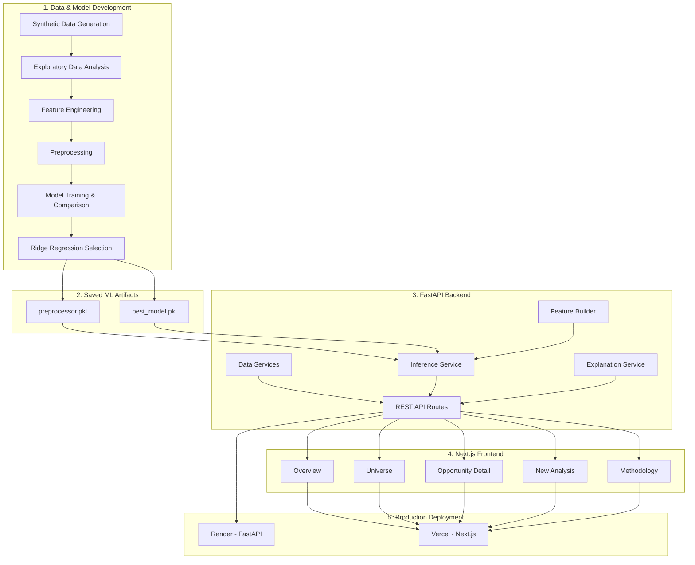

# AI Investment Opportunity Analyzer

A full-stack machine learning decision-support application for evaluating synthetic investment opportunities, estimating an Investment Score from 0 to 100, and classifying each opportunity as Invest, Review, or Reject.


---

## Overview

AI Investment Opportunity Analyzer is an end-to-end machine learning application that simulates how investment opportunities could be evaluated through a structured scoring and recommendation workflow.

The system analyzes financial, market, strategic, risk, sustainability, sector, and regional factors to estimate an Investment Score between 0 and 100.

The predicted score is converted into one of three recommendation categories:

- **Invest**
- **Review**
- **Reject**

The current application uses a decoupled full-stack architecture:

- **Next.js** for the production frontend
- **FastAPI** for the backend API
- **Scikit-learn** for preprocessing and model inference
- **Ridge Regression** as the selected estimator
- **Vercel** for frontend deployment
- **Render** for backend deployment

The project covers the complete machine learning lifecycle, including synthetic data generation, exploratory data analysis, feature engineering, preprocessing, model comparison, explainability, prediction, API development, frontend integration, testing, and cloud deployment.

---

## Important Disclaimer

> [!WARNING]
> This project uses a fully synthetic dataset created for educational and portfolio purposes.
>
> It does not use real investment data and must not be treated as financial advice or used for real investment decisions without validated data, domain-expert review, governance, and additional testing.

---

## Key Features

- Generate a synthetic investment-opportunity dataset
- Analyze 5,000 synthetic opportunity records
- Explore opportunities across multiple sectors and Saudi regions
- Calculate an Investment Score from 0 to 100
- Classify opportunities as Invest, Review, or Reject
- Compare multiple regression algorithms
- Select the best-performing model using Mean Absolute Error
- Preprocess numerical and categorical features
- Scale numerical variables with StandardScaler
- Encode categorical variables with OneHotEncoder
- Create financial, market, strategic, sustainability, and risk features
- Rank opportunities using live search, filters, scoring, and pagination
- Inspect detailed information for individual opportunities
- Predict scores for new opportunity profiles
- Convert 10 simplified user inputs into the model's complete feature contract
- Generate local Ridge Regression model contributions
- Separate positive and negative contribution drivers
- Expose model and dataset functionality through a FastAPI backend
- Provide a production Next.js research-workstation interface
- Handle API online, offline, loading, empty, and validation states
- Preserve the trained model and preprocessing pipeline using Joblib
- Validate migration and API behavior with automated tests
- Deploy the frontend and backend independently using Vercel and Render

---

## Live Demo

### Application

[Open the AI Investment Opportunity Analyzer](https://ai-investment-opportunity-analyzer.vercel.app)

### FastAPI Backend

[Open the API Documentation](https://ai-investment-opportunity-analyzer.onrender.com/docs)

### API Health

[Check API Health](https://ai-investment-opportunity-analyzer.onrender.com/health)

> [!NOTE]
> The backend currently uses Render's free compute tier. After a period of inactivity, the service may spin down and the first request can take longer while the API starts again.

---

## Demo Workflow

The production application contains five main areas.

### 1. Overview

Review the complete synthetic investment universe through:

- Total number of opportunities
- Average Investment Score
- Average overall risk
- Number of Invest opportunities
- Recommendation distribution
- Investment-score distribution
- Sector ranking
- Region ranking

All displayed values are loaded from the live FastAPI backend.

### 2. Universe

Explore and rank the 5,000 synthetic opportunities using:

- Opportunity name or ID search
- Sector filter
- Region filter
- Recommendation filter
- Investment Score range
- API-managed pagination

The ranking workflow uses consistent backend query logic rather than client-only filtering.

### 3. Opportunity Detail

Open an individual opportunity to inspect information such as:

- Opportunity name and ID
- Sector
- Region
- Investment Score
- Recommendation
- Expected ROI
- Overall risk
- Investment size
- Payback period
- Strategic impact
- Sustainability
- Additional model and decision factors

The page retrieves the selected opportunity directly from FastAPI.

### 4. New Analysis

Submit a simplified 10-field opportunity profile using:

- Sector
- Region
- Competition level
- Investment size
- Expected ROI
- Payback period
- Market demand
- Risk level
- Strategic alignment
- Sustainability

The backend converts these inputs into the full model feature contract before applying the saved preprocessing pipeline and Ridge Regression model.

The result includes:

- Investment Score
- Invest / Review / Reject recommendation
- Estimated risk
- Positive model contributions
- Negative model contributions
- Contribution magnitude and direction

Model contributions describe arithmetic influence on the predicted score and do not establish causation.

### 5. Methodology

Review the technical contract behind the deployed application, including:

- Selected estimator
- Artifact runtime
- Dataset size
- Public input contract
- Raw feature frame
- Transformed feature frame
- Recommendation thresholds
- Interpretation limitations
- Synthetic-data disclaimer

---

## System Architecture



---

## Machine Learning Workflow

### 1. Synthetic data generation

The project generates 5,000 synthetic investment-opportunity records with 42 columns.

The dataset includes information related to:

- Financial performance
- Investment size
- Capital and operating costs
- Expected ROI
- Internal rate of return
- Net present value
- Payback period
- Market size and growth
- Customer demand and adoption
- Strategic alignment
- Risk indicators
- Sustainability and ESG
- Sector
- Region
- Competition level

### 2. Exploratory data analysis

The dataset is explored through:

- Summary statistics
- Investment-score distributions
- Recommendation distributions
- Sector comparisons
- Region comparisons
- Correlation analysis
- Risk-versus-score comparisons
- ROI-versus-score comparisons
- Strategic-impact analysis

### 3. Feature engineering

The project creates additional decision-support features, including:

- Overall risk score
- Strategic impact score
- Sustainability score
- Market attractiveness score
- Financial strength score
- Risk-adjusted ROI
- Profitability index
- Payback efficiency

### 4. Data preprocessing

Numerical features are standardized using:

```text
StandardScaler
```

Categorical features are encoded using:

```text
OneHotEncoder
```

The fitted preprocessing pipeline is stored and reused during inference.

### 5. Model training

The machine learning task is formulated as a regression problem.

The target variable is:

```text
Investment Score: 0–100
```

Five regression algorithms are trained and compared.

### 6. Model evaluation

The models are evaluated using:

- Mean Absolute Error
- Root Mean Squared Error
- R² score

The model with the lowest recorded Mean Absolute Error is selected.

### 7. Prediction

The selected model predicts an Investment Score, which is bounded between 0 and 100.

### 8. Recommendation generation

The predicted score is converted into an Invest, Review, or Reject recommendation.

### 9. Explainability

For each new prediction, the application calculates local model contributions using processed feature values and Ridge Regression coefficients.

The production interface separates:

- Positive model contributions
- Negative model contributions
- Contribution direction
- Signed contribution magnitude

These values describe arithmetic influence within the model and must not be interpreted as causal effects.

---

## Models Compared

The following regression models were evaluated:

- Linear Regression
- Ridge Regression
- Random Forest Regressor
- Gradient Boosting Regressor
- Extra Trees Regressor

The recorded model-comparison results are:

| Model | MAE | RMSE | R² |
|---|---:|---:|---:|
| Ridge Regression | 7.3260 | 9.3381 | 0.8394 |
| Linear Regression | 7.3466 | 9.3661 | 0.8384 |
| Gradient Boosting | 8.0693 | 10.1460 | 0.8104 |
| Extra Trees | 8.7917 | 11.0306 | 0.7759 |
| Random Forest | 8.8311 | 11.0148 | 0.7765 |

---

## Selected Model

The selected model is:

```text
Ridge Regression
```

Ridge Regression achieved the lowest Mean Absolute Error in the recorded model comparison:

```text
MAE  = 7.3260
RMSE = 9.3381
R²   = 0.8394
```

Ridge Regression also supports coefficient-based contribution analysis, allowing the application to describe the direction and arithmetic contribution of processed model features.

---

## Recommendation Logic

The predicted Investment Score is mapped to a recommendation using the following thresholds:

| Score Range | Recommendation |
|---|---|
| 75–100 | Invest |
| 45–74.99 | Review |
| Below 45 | Reject |

The implemented logic is:

```python
if score >= 75:
    recommendation = "Invest"
elif score >= 45:
    recommendation = "Review"
else:
    recommendation = "Reject"
```

These thresholds are project-defined decision rules created for the synthetic portfolio scenario. They are not validated financial standards.

---

## Prediction Explainability

The application explains Ridge Regression predictions using local model contributions.

For each processed feature:

```text
Feature Contribution = Processed Feature Value × Model Coefficient
```

Positive values increase the raw model score relative to the model intercept, while negative values reduce it.

The production interface displays:

- Positive contribution drivers
- Negative contribution drivers
- Signed contribution values
- Relative contribution bars

The interface intentionally avoids causal language.

> Model contributions indicate arithmetic influence on the predicted score, not causation.

---

## Tech Stack

| Category | Technology |
|---|---|
| Frontend | Next.js |
| Frontend language | TypeScript |
| Backend API | FastAPI |
| Backend language | Python |
| Machine learning | Scikit-learn |
| Selected model | Ridge Regression |
| Data processing | Pandas |
| Numerical operations | NumPy |
| Preprocessing | StandardScaler and OneHotEncoder |
| Model persistence | Joblib |
| Experiments | Jupyter Notebook |
| Testing | Pytest |
| Data format | CSV |
| Frontend deployment | Vercel |
| Backend deployment | Render |
| API interface | REST / JSON |

---

## Project Structure

```text
ai-investment-opportunity-analyzer/
├── frontend/
│   ├── app/
│   │   ├── analysis/
│   │   │   └── new/
│   │   ├── methodology/
│   │   ├── opportunities/
│   │   │   └── [id]/
│   │   ├── globals.css
│   │   ├── layout.tsx
│   │   └── page.tsx
│   │
│   ├── components/
│   ├── lib/
│   │   └── api/
│   ├── package.json
│   └── next.config.ts
│
├── backend/
│   ├── app/
│   │   ├── api/
│   │   │   └── routes/
│   │   ├── core/
│   │   ├── schemas/
│   │   ├── services/
│   │   └── main.py
│   │
│   └── requirements.txt
│
├── app/
│   └── streamlit_app.py
│
├── data/
│   ├── raw/
│   │   └── synthetic_investment_opportunities.csv
│   └── processed/
│
├── models/
│   ├── best_model.pkl
│   ├── model_metadata.json
│   └── preprocessor.pkl
│
├── notebooks/
│   ├── 01_data_generation.ipynb
│   ├── 02_eda.ipynb
│   ├── 03_preprocessing_feature_engineering.ipynb
│   ├── 04_model_training_comparison.ipynb
│   ├── 05_explainability.ipynb
│   └── 06_final_pipeline_test.ipynb
│
├── reports/
│   ├── figures/
│   ├── feature_importance.csv
│   ├── local_explanation_example.csv
│   ├── model_comparison_results.csv
│   ├── recommendation_summary.csv
│   ├── region_score_summary.csv
│   ├── score_correlations.csv
│   ├── sector_score_summary.csv
│   ├── test_predictions.csv
│   └── top_10_opportunities.csv
│
├── src/
│   ├── explanations.py
│   ├── predict.py
│   └── scoring.py
│
├── tests/
│   ├── test_fastapi_api.py
│   ├── test_backend_data_service.py
│   ├── test_backend_explanations.py
│   ├── test_backend_feature_builder.py
│   ├── test_backend_inference.py
│   ├── test_backend_scoring.py
│   └── additional parity and regression tests
│
├── .gitignore
├── deployment_notes.md
├── requirements.txt
└── README.md
```

The original Streamlit application is retained in the repository as part of the project's development history. The production application uses the Next.js and FastAPI architecture.

---

## Installation

### 1. Clone the repository

```bash
git clone https://github.com/Azoqoz/ai-investment-opportunity-analyzer.git
cd ai-investment-opportunity-analyzer
```

### 2. Create a Python virtual environment

#### Windows

```powershell
python -m venv .venv
.venv\Scripts\activate
```

#### macOS / Linux

```bash
python3 -m venv .venv
source .venv/bin/activate
```

### 3. Install backend dependencies

```bash
pip install -r backend/requirements.txt
```

### 4. Install frontend dependencies

```bash
cd frontend
npm install
```

No external paid API or model provider is required.

---

## Running the Application

The production architecture uses two local services.

### 1. Start FastAPI

From the repository root:

```bash
python -m uvicorn backend.app.main:app --reload
```

The API will normally be available at:

```text
http://127.0.0.1:8000
```

Interactive API documentation:

```text
http://127.0.0.1:8000/docs
```

### 2. Start Next.js

Open another terminal:

```bash
cd frontend
npm run dev
```

The frontend will normally be available at:

```text
http://localhost:3000
```

---

## API Endpoints

The FastAPI backend provides the application with live model and dataset functionality.

Primary routes include:

```text
GET  /health
GET  /overview
GET  /opportunities
GET  /opportunities/{opportunity_id}
POST /predict
GET  /docs
```

### Health

Checks whether the application has successfully loaded:

- Dataset
- Model
- Preprocessor

### Overview

Returns:

- Portfolio-level metrics
- Recommendation distribution
- Investment-score histogram
- Sector rankings
- Region rankings

### Opportunities

Supports:

- Search
- Filtering
- Ranking
- Pagination

### Opportunity Detail

Returns the complete stored record for a selected opportunity.

### Predict

Accepts the simplified opportunity profile, builds the full model feature frame, applies preprocessing, generates the Investment Score and recommendation, and returns model contributions.

---

## Validation

The migration and backend behavior are protected by automated tests covering areas such as:

- Dataset baseline integrity
- Recommendation thresholds
- Filtering and ranking
- Search behavior
- Pagination
- Simplified feature construction
- Raw feature order
- Model and preprocessor loading
- Golden prediction cases
- Prediction repeatability
- FastAPI endpoints
- API validation
- Explanation behavior
- Claim-safety terminology

The final backend test suite completed with:

```text
111 passed
0 failed
```

The production frontend also passed:

```text
npm run lint
npm run build
```

The final deployed application was manually verified across:

- Overview
- Universe
- Opportunity Detail
- New Analysis
- Methodology

---

## Reproducing the Machine Learning Workflow

The notebooks are organized in execution order.

Run them sequentially:

```text
01_data_generation.ipynb
02_eda.ipynb
03_preprocessing_feature_engineering.ipynb
04_model_training_comparison.ipynb
05_explainability.ipynb
06_final_pipeline_test.ipynb
```

This workflow reproduces:

1. Synthetic data generation
2. Exploratory data analysis
3. Data preprocessing
4. Feature engineering
5. Model training
6. Model comparison
7. Best-model selection
8. Explainability outputs
9. Final prediction-pipeline validation

The trained model and preprocessor are stored in:

```text
models/best_model.pkl
models/preprocessor.pkl
```

---

## Deployment

The production application is deployed as two independent services.

### Frontend — Vercel

```text
Platform: Vercel
Framework: Next.js
Root Directory: frontend
Branch: main
```

Frontend environment variable:

```text
NEXT_PUBLIC_API_BASE_URL=https://ai-investment-opportunity-analyzer.onrender.com
```

Production URL:

```text
https://ai-investment-opportunity-analyzer.vercel.app
```

### Backend — Render

```text
Platform: Render
Runtime: Python
Branch: main
Root Directory: repository root
```

Build command:

```bash
pip install -r backend/requirements.txt
```

Start command:

```bash
uvicorn backend.app.main:app --host 0.0.0.0 --port $PORT
```

Production API:

```text
https://ai-investment-opportunity-analyzer.onrender.com
```

The backend uses an `ALLOWED_ORIGINS` environment variable to authorize the production Vercel frontend through CORS.

---

## Screenshots and Results

### Model Comparison


### Actual vs. Predicted Scores


### Investment Score Distribution


### Feature Importance


### Local Prediction Explanation


---

## Current Limitations

- The dataset is entirely synthetic
- The model has not been validated using real investment outcomes
- Recommendation thresholds are manually defined project rules
- The model may reproduce assumptions embedded in the synthetic data-generation process
- Simplified public inputs generate additional model features using predefined mappings and formulas
- Coefficient-based model contributions do not establish causation
- The application does not include real-time financial or market data
- The application does not include authentication or saved user sessions
- The current model results do not demonstrate performance on a real production distribution
- The Render free backend may spin down after inactivity, which can increase the latency of the first request
- The system should not replace financial analysis, due diligence, or expert judgment

---

## Future Improvements

- Train and validate the system using a governed real-world dataset
- Add cross-validation and systematic hyperparameter tuning
- Add SHAP-based global and local explanations
- Add formal model and dataset versioning
- Add experiment tracking
- Add stricter production data-validation checks
- Add model-drift and data-drift monitoring
- Add scenario comparison between multiple opportunities
- Add downloadable analysis reports
- Add user authentication
- Add saved analysis sessions
- Add Docker support
- Add a formal CI pipeline for automated test execution
- Add external market-data integrations
- Add persistent application storage
- Add human approval and governance workflows
- Add production observability and model-monitoring capabilities

---

## Why This Project Matters

This project demonstrates a complete applied machine learning and AI engineering workflow rather than only presenting a trained notebook model.

It covers practical skills including:

- Synthetic data generation
- Exploratory data analysis
- Feature engineering
- Numerical and categorical preprocessing
- Regression model development
- Model evaluation and comparison
- Model selection
- Prediction-pipeline construction
- Model persistence
- Explainable machine learning
- Decision-rule implementation
- Framework-neutral backend services
- REST API development with FastAPI
- Typed frontend integration
- Next.js application development
- Search, filtering, ranking, and pagination
- Automated parity and regression testing
- API validation and error handling
- Production frontend/backend separation
- CORS configuration
- Vercel deployment
- Render deployment
- User-focused presentation of technical model outputs

The project shows how a machine learning model can be transformed into a tested, deployed, full-stack decision-support system while clearly communicating its assumptions, limitations, and interpretation boundaries.

---

## Author

Developed by [Azoqoz](https://github.com/Azoqoz).

**Live Application:**  
https://ai-investment-opportunity-analyzer.vercel.app
