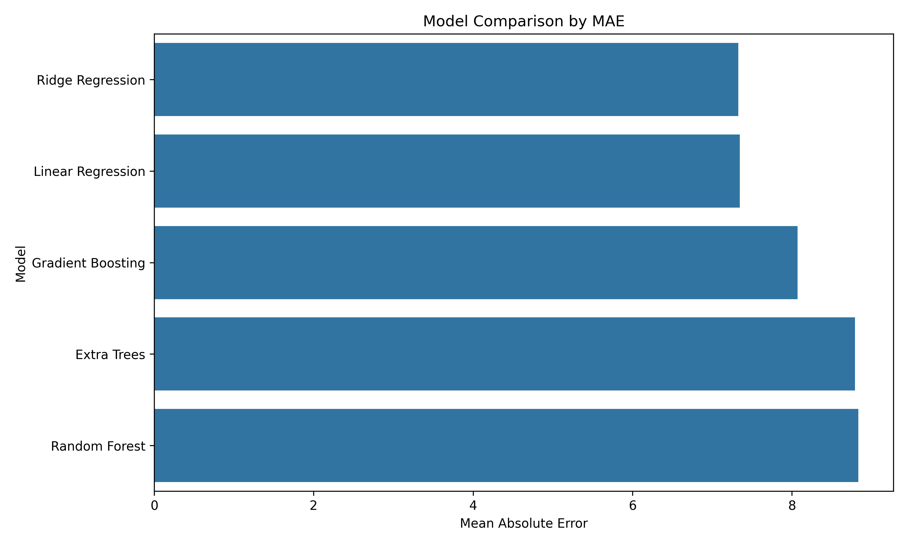
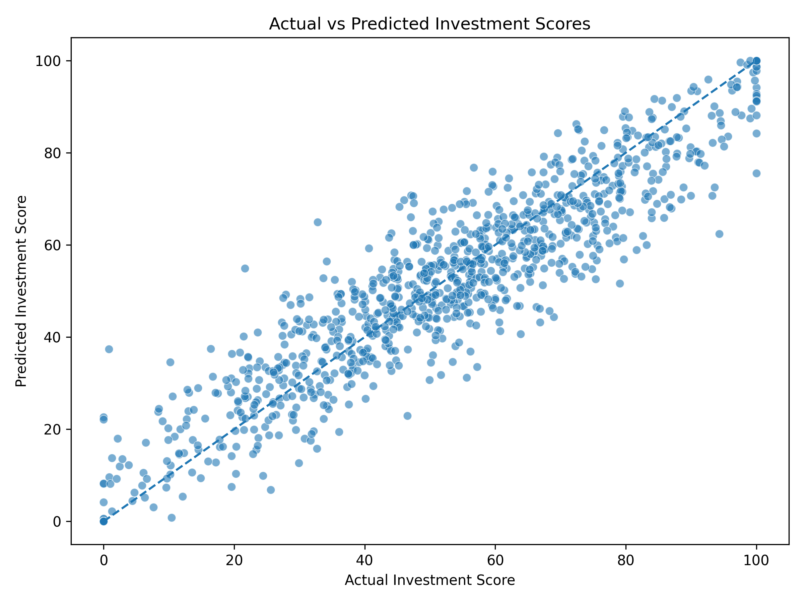
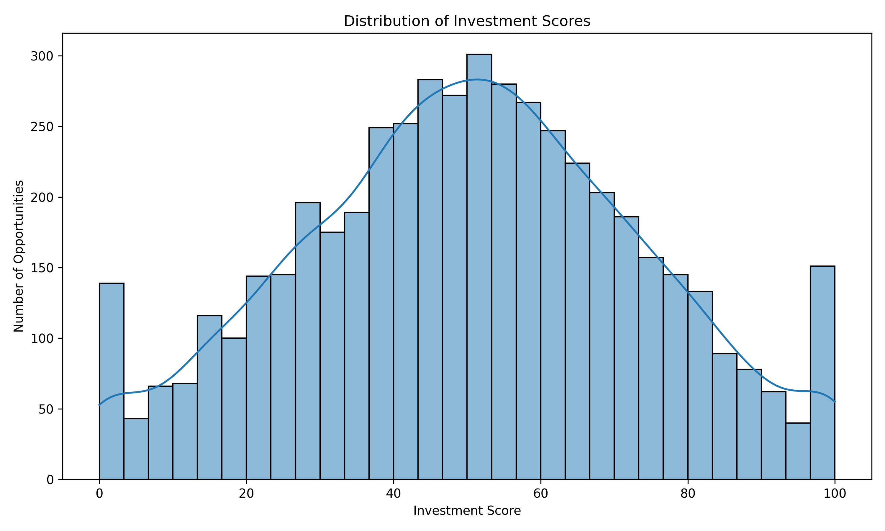
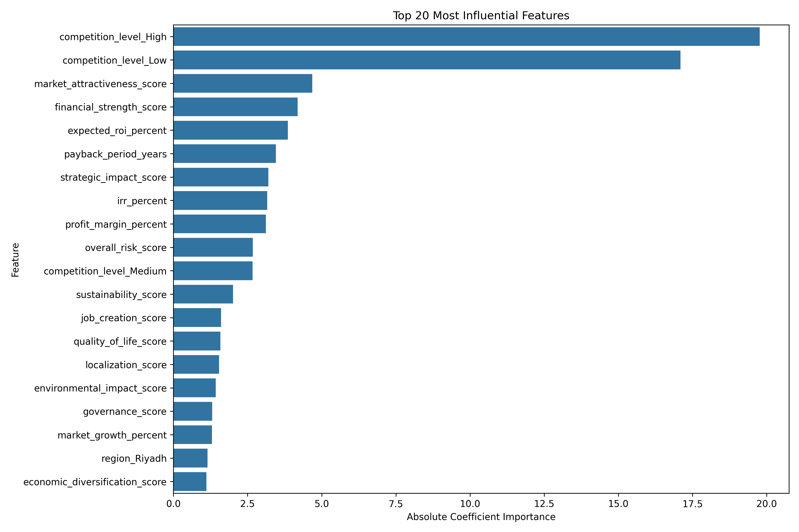
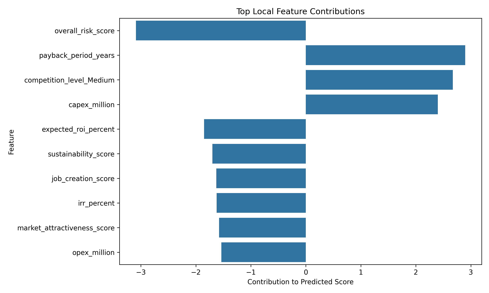

# AI Investment Opportunity Analyzer

A full-stack machine learning decision-support application for evaluating synthetic investment opportunities, estimating an Investment Score from 0 to 100, and classifying each opportunity as **Invest**, **Review**, or **Reject**.


---

## Live Application

- **Web Application:** https://ai-investment-opportunity-analyzer.vercel.app
- **API Documentation:** https://ai-investment-opportunity-analyzer.onrender.com/docs
- **API Health:** https://ai-investment-opportunity-analyzer.onrender.com/health

> The backend runs on Render's free compute tier and may require a short cold start after periods of inactivity.

---

## Important Disclaimer

> [!WARNING]
> This project uses a fully synthetic dataset created for educational and portfolio purposes.
>
> It does not use real investment data and must not be treated as financial advice or used for real investment decisions without validated data, domain-expert review, governance, and additional testing.

---

## Overview

AI Investment Opportunity Analyzer is an end-to-end machine learning application that demonstrates how structured opportunity data can move from model development into a tested, deployed decision-support product.

The system analyzes financial, market, strategic, risk, sustainability, sector, and regional factors to estimate an:

```text
Investment Score: 0–100
```

The score is then mapped into one of three project-defined recommendation categories:

```text
Invest
Review
Reject
```

The production application uses a decoupled full-stack architecture:

```text
Next.js Frontend
       ↓
FastAPI Backend
       ↓
Preprocessing Pipeline
       ↓
Ridge Regression
       ↓
Investment Score
       ↓
Invest / Review / Reject
```

The project covers the complete machine learning lifecycle, including:

- Synthetic data generation
- Exploratory data analysis
- Feature engineering
- Numerical and categorical preprocessing
- Regression-model comparison
- Best-model selection
- Prediction explainability
- Model persistence
- FastAPI development
- Next.js integration
- Automated testing
- Independent frontend and backend deployment

---

## Key Features

- Generate a synthetic investment-opportunity dataset
- Analyze 5,000 synthetic opportunity records
- Explore opportunities across multiple sectors and Saudi regions
- Estimate an Investment Score between 0 and 100
- Classify opportunities as Invest, Review, or Reject
- Compare multiple regression algorithms
- Select the recorded best-performing model using Mean Absolute Error
- Scale numerical variables with StandardScaler
- Encode categorical variables with OneHotEncoder
- Engineer financial, market, strategic, sustainability, and risk features
- Search, filter, rank, and paginate the opportunity universe
- Inspect detailed individual opportunity profiles
- Predict scores for new opportunity profiles
- Convert 10 public user inputs into the model's full feature contract
- Generate local Ridge Regression feature contributions
- Separate positive and negative model contributions
- Expose model and dataset functionality through FastAPI
- Provide a production Next.js research-workstation interface
- Handle API online, offline, loading, validation, and empty states
- Persist the trained model and preprocessing pipeline with Joblib
- Validate API and migration behavior through automated tests
- Deploy the frontend and backend independently using Vercel and Render

---

## Application Workflow

The production application contains five main areas.

### 1. Overview

The Overview provides a high-level view of the synthetic investment universe.

It includes:

- Total opportunities
- Average Investment Score
- Average overall risk
- Number of Invest opportunities
- Recommendation distribution
- Investment-score distribution
- Sector ranking
- Region ranking

All displayed values are retrieved from the FastAPI backend.

---

### 2. Universe

The Universe allows users to explore and rank the 5,000 synthetic opportunities.

Available controls include:

- Opportunity name or ID search
- Sector filtering
- Region filtering
- Recommendation filtering
- Investment Score range
- API-managed pagination

Filtering and ranking use backend query logic rather than client-only filtering.

---

### 3. Opportunity Detail

Each opportunity can be opened individually.

The detail view can include:

- Opportunity name
- Opportunity ID
- Sector
- Region
- Investment Score
- Recommendation
- Expected ROI
- Overall risk
- Investment size
- Payback period
- Strategic impact
- Sustainability
- Additional model and decision factors

The selected record is retrieved directly from FastAPI.

---

### 4. New Analysis

Users can submit a simplified 10-field opportunity profile.

Inputs include:

```text
Sector
Region
Competition level
Investment size
Expected ROI
Payback period
Market demand
Risk level
Strategic alignment
Sustainability
```

The backend transforms these simplified inputs into the full model feature contract before applying the saved preprocessing pipeline and Ridge Regression model.

The result includes:

- Investment Score
- Invest / Review / Reject recommendation
- Estimated risk
- Positive model contributions
- Negative model contributions
- Contribution magnitude and direction

Model contributions describe arithmetic influence within the fitted model.

They do not establish causation.

---

### 5. Methodology

The Methodology area exposes the technical contract behind the application.

It includes:

- Selected estimator
- Artifact runtime
- Dataset size
- Public input contract
- Raw feature frame
- Transformed feature frame
- Recommendation thresholds
- Interpretation limitations
- Synthetic-data disclaimer

---

## System Architecture


---

## Machine Learning Workflow

### 1. Synthetic Data Generation

The project generates:

```text
5,000 synthetic investment opportunities
42 dataset columns
```

The dataset includes information related to:

- Financial performance
- Investment size
- Capital and operating costs
- Expected ROI
- Internal rate of return
- Net present value
- Payback period
- Market size and growth
- Customer demand and adoption
- Strategic alignment
- Risk indicators
- Sustainability and ESG
- Sector
- Region
- Competition level

The dataset is intentionally synthetic and does not represent real investment outcomes.

---

### 2. Exploratory Data Analysis

The dataset is explored through:

- Summary statistics
- Investment-score distributions
- Recommendation distributions
- Sector comparisons
- Region comparisons
- Correlation analysis
- Risk-versus-score comparisons
- ROI-versus-score comparisons
- Strategic-impact analysis

---

### 3. Feature Engineering

Additional decision-support features include:

- Overall risk score
- Strategic impact score
- Sustainability score
- Market attractiveness score
- Financial strength score
- Risk-adjusted ROI
- Profitability index
- Payback efficiency

---

### 4. Data Preprocessing

Numerical features are standardized using:

```text
StandardScaler
```

Categorical features are encoded using:

```text
OneHotEncoder
```

The fitted preprocessing pipeline is saved and reused during inference.

---

### 5. Model Training

The machine learning problem is formulated as regression.

Target:

```text
Investment Score: 0–100
```

Five regression algorithms are trained and compared.

---

### 6. Model Evaluation

The models are evaluated using:

```text
Mean Absolute Error
Root Mean Squared Error
R² Score
```

The model with the lowest recorded Mean Absolute Error is selected.

---

### 7. Prediction

The selected model generates an Investment Score.

The application constrains the resulting score to:

```text
0–100
```

---

### 8. Recommendation Generation

The Investment Score is converted into a project-defined recommendation.

```text
Investment Score
       ↓
Recommendation Rules
       ↓
Invest / Review / Reject
```

---

### 9. Prediction Explainability

The application calculates local model contributions from the processed feature values and Ridge Regression coefficients.

It separates:

- Positive contributions
- Negative contributions
- Contribution direction
- Signed contribution magnitude

These values represent arithmetic contribution within the model.

They are not causal explanations.

---

## Models Compared

The following regression models were evaluated:

| Model | MAE | RMSE | R² |
|---|---:|---:|---:|
| Ridge Regression | 7.3260 | 9.3381 | 0.8394 |
| Linear Regression | 7.3466 | 9.3661 | 0.8384 |
| Gradient Boosting | 8.0693 | 10.1460 | 0.8104 |
| Extra Trees | 8.7917 | 11.0306 | 0.7759 |
| Random Forest | 8.8311 | 11.0148 | 0.7765 |

---

## Selected Model

The selected model is:

```text
Ridge Regression
```

Recorded evaluation results:

```text
MAE  = 7.3260
RMSE = 9.3381
R²   = 0.8394
```

Ridge Regression recorded the lowest MAE in the documented comparison.

It also supports coefficient-based contribution analysis, which allows the application to expose how transformed features contribute arithmetically to a prediction.

Because the dataset is synthetic, these metrics describe performance only against the project's synthetic target-generating process.

They do not demonstrate real-world investment predictive performance.

---

## Recommendation Logic

The predicted Investment Score is mapped using the following project-defined thresholds:

| Score Range | Recommendation |
|---|---|
| 75–100 | Invest |
| 45–74.99 | Review |
| Below 45 | Reject |

Implementation:

```python
if score >= 75:
    recommendation = "Invest"
elif score >= 45:
    recommendation = "Review"
else:
    recommendation = "Reject"
```

These thresholds are application rules created for the synthetic portfolio scenario.

They are not validated financial standards.

---

## Prediction Explainability

Ridge Regression predictions are explained using local model contributions.

For each processed feature:

```text
Feature Contribution
=
Processed Feature Value × Model Coefficient
```

Positive values raise the raw model score relative to the intercept.

Negative values reduce it.

The production interface displays:

- Positive contribution drivers
- Negative contribution drivers
- Signed contribution values
- Relative contribution bars

> Model contributions indicate arithmetic influence on the predicted score, not causation.

---

## Tech Stack

| Category | Technology |
|---|---|
| Frontend | Next.js |
| Frontend language | TypeScript |
| Backend API | FastAPI |
| Backend language | Python |
| Machine learning | Scikit-learn |
| Selected model | Ridge Regression |
| Data processing | Pandas |
| Numerical operations | NumPy |
| Numerical preprocessing | StandardScaler |
| Categorical preprocessing | OneHotEncoder |
| Model persistence | Joblib |
| Experiments | Jupyter Notebook |
| Backend testing | Pytest |
| Data format | CSV |
| API interface | REST / JSON |
| Frontend deployment | Vercel |
| Backend deployment | Render |

---

## Project Structure

```text
ai-investment-opportunity-analyzer/
├── frontend/
│   ├── app/
│   │   ├── analysis/
│   │   │   └── new/
│   │   ├── methodology/
│   │   ├── opportunities/
│   │   │   └── [id]/
│   │   ├── globals.css
│   │   ├── layout.tsx
│   │   └── page.tsx
│   │
│   ├── components/
│   ├── lib/
│   │   └── api/
│   ├── package.json
│   └── next.config.ts
│
├── backend/
│   ├── app/
│   │   ├── api/
│   │   │   └── routes/
│   │   ├── core/
│   │   ├── schemas/
│   │   ├── services/
│   │   └── main.py
│   │
│   └── requirements.txt
│
├── app/
│   └── streamlit_app.py
│
├── data/
│   ├── raw/
│   │   └── synthetic_investment_opportunities.csv
│   └── processed/
│
├── models/
│   ├── best_model.pkl
│   ├── model_metadata.json
│   └── preprocessor.pkl
│
├── notebooks/
│   ├── 01_data_generation.ipynb
│   ├── 02_eda.ipynb
│   ├── 03_preprocessing_feature_engineering.ipynb
│   ├── 04_model_training_comparison.ipynb
│   ├── 05_explainability.ipynb
│   └── 06_final_pipeline_test.ipynb
│
├── reports/
│   ├── figures/
│   ├── feature_importance.csv
│   ├── local_explanation_example.csv
│   ├── model_comparison_results.csv
│   ├── recommendation_summary.csv
│   ├── region_score_summary.csv
│   ├── score_correlations.csv
│   ├── sector_score_summary.csv
│   ├── test_predictions.csv
│   └── top_10_opportunities.csv
│
├── src/
│   ├── explanations.py
│   ├── predict.py
│   └── scoring.py
│
├── tests/
│   ├── test_fastapi_api.py
│   ├── test_backend_data_service.py
│   ├── test_backend_explanations.py
│   ├── test_backend_feature_builder.py
│   ├── test_backend_inference.py
│   ├── test_backend_scoring.py
│   └── additional parity and regression tests
│
├── .gitignore
├── deployment_notes.md
├── requirements.txt
└── README.md
```

The original Streamlit application is retained as part of the project's development history.

The current production architecture uses:

```text
Next.js + FastAPI
```

---

## Installation

### 1. Clone the Repository

```bash
git clone https://github.com/Azoqoz/ai-investment-opportunity-analyzer.git
cd ai-investment-opportunity-analyzer
```

### 2. Create a Python Virtual Environment

#### Windows

```powershell
python -m venv .venv
.venv\Scripts\activate
```

#### macOS / Linux

```bash
python3 -m venv .venv
source .venv/bin/activate
```

### 3. Install Backend Dependencies

```bash
pip install -r backend/requirements.txt
```

### 4. Install Frontend Dependencies

```bash
cd frontend
npm install
```

No paid external model provider is required.

---

## Running the Application

The current architecture runs two local services.

### 1. Start FastAPI

From the repository root:

```bash
python -m uvicorn backend.app.main:app --reload
```

Backend:

```text
http://127.0.0.1:8000
```

Interactive API documentation:

```text
http://127.0.0.1:8000/docs
```

---

### 2. Start Next.js

Open another terminal:

```bash
cd frontend
npm run dev
```

Frontend:

```text
http://localhost:3000
```

---

## API

The FastAPI backend exposes model and dataset functionality to the frontend.

Primary routes:

```text
GET  /health
GET  /overview
GET  /opportunities
GET  /opportunities/{opportunity_id}
POST /predict
GET  /docs
```

### Health

Checks whether the application successfully loaded:

- Dataset
- Model
- Preprocessor

### Overview

Returns:

- Portfolio metrics
- Recommendation distribution
- Investment-score histogram
- Sector rankings
- Region rankings

### Opportunities

Supports:

- Search
- Filtering
- Ranking
- Pagination

### Opportunity Detail

Returns the stored record for a selected synthetic opportunity.

### Predict

The prediction endpoint follows this flow:

```text
Simplified User Inputs
        ↓
Feature Builder
        ↓
Full Raw Feature Frame
        ↓
Saved Preprocessor
        ↓
Ridge Regression
        ↓
Investment Score
        ↓
Recommendation
        ↓
Model Contributions
```

---

## Testing

The backend behavior and frontend migration are protected by automated tests.

The current documented backend test result is:

```text
111 passed
0 failed
```

Coverage includes:

- Dataset baseline integrity
- Recommendation thresholds
- Filtering and ranking
- Search behavior
- Pagination
- Simplified feature construction
- Raw feature ordering
- Model and preprocessor loading
- Golden prediction cases
- Prediction repeatability
- FastAPI endpoints
- API validation
- Explanation behavior
- Claim-safety terminology

Frontend validation also passes:

```bash
cd frontend
npm run lint
npm run build
```

The deployed application has also been manually checked across:

```text
Overview
Universe
Opportunity Detail
New Analysis
Methodology
```

---

## Reproducing the Machine Learning Workflow

The notebooks are organized in execution order.

Run:

```text
01_data_generation.ipynb
02_eda.ipynb
03_preprocessing_feature_engineering.ipynb
04_model_training_comparison.ipynb
05_explainability.ipynb
06_final_pipeline_test.ipynb
```

This reproduces:

```text
Synthetic Data Generation
        ↓
Exploratory Data Analysis
        ↓
Preprocessing
        ↓
Feature Engineering
        ↓
Model Training
        ↓
Model Comparison
        ↓
Best-Model Selection
        ↓
Explainability
        ↓
Final Pipeline Validation
```

Saved artifacts:

```text
models/best_model.pkl
models/preprocessor.pkl
```

---

## Deployment

The production application is deployed as two independent services.

### Frontend — Vercel

Configuration:

```text
Platform: Vercel
Framework: Next.js
Root Directory: frontend
Branch: main
```

Environment variable:

```env
NEXT_PUBLIC_API_BASE_URL=https://ai-investment-opportunity-analyzer.onrender.com
```

Production frontend:

```text
https://ai-investment-opportunity-analyzer.vercel.app
```

---

### Backend — Render

Configuration:

```text
Platform: Render
Runtime: Python
Branch: main
Root Directory: repository root
```

Build command:

```bash
pip install -r backend/requirements.txt
```

Start command:

```bash
uvicorn backend.app.main:app --host 0.0.0.0 --port $PORT
```

Production API:

```text
https://ai-investment-opportunity-analyzer.onrender.com
```

The backend uses the `ALLOWED_ORIGINS` environment variable to authorize the production Vercel frontend through CORS.

> Render free instances may spin down after inactivity, which can increase latency for the first request after a cold start.

---

## Screenshots and Results

### Model Comparison



### Actual vs. Predicted Scores



### Investment Score Distribution



### Feature Importance



### Local Prediction Explanation



---

## Legacy Interface

The repository retains the original Streamlit application:

```text
app/streamlit_app.py
```

It is kept as part of the project's development history.

The current production application uses:

```text
Next.js + FastAPI
```

---

## Current Limitations

- The dataset is entirely synthetic
- The model has not been validated against real investment outcomes
- Recommendation thresholds are manually defined project rules
- Model performance metrics describe the synthetic dataset rather than a real production distribution
- The model can reproduce assumptions embedded in the synthetic data-generation process
- Simplified public inputs generate additional model features using predefined mappings and formulas
- Coefficient-based model contributions do not establish causation
- The application does not use real-time financial or market data
- The application does not include authentication
- Saved user sessions are not implemented
- The Render free backend can introduce cold-start latency
- The system must not replace financial analysis, due diligence, or expert judgment

---

## Future Improvements

- Train and validate the system using a governed real-world dataset
- Add cross-validation
- Add systematic hyperparameter tuning
- Add SHAP-based global and local explanations
- Add formal dataset versioning
- Add formal model versioning
- Add experiment tracking
- Add stricter production data validation
- Add model-drift monitoring
- Add data-drift monitoring
- Add scenario comparison between opportunities
- Add downloadable analysis reports
- Add user authentication
- Add saved analysis sessions
- Add Docker support
- Add CI for automated test execution
- Add external market-data integrations
- Add persistent application storage
- Add human approval and governance workflows
- Add production observability
- Add model-monitoring capabilities

---

## Why This Project Matters

This project demonstrates more than training a regression model in a notebook.

It covers a complete applied machine learning and AI engineering workflow:

- Synthetic data generation
- Exploratory data analysis
- Feature engineering
- Numerical and categorical preprocessing
- Regression model development
- Model evaluation and comparison
- Model selection
- Prediction-pipeline construction
- Model persistence
- Explainable machine learning
- Decision-rule implementation
- Framework-neutral backend services
- REST API development with FastAPI
- Typed frontend integration
- Next.js application development
- Search, filtering, ranking, and pagination
- Automated parity and regression testing
- API validation and error handling
- Production frontend / backend separation
- CORS configuration
- Vercel deployment
- Render deployment
- User-focused presentation of technical model outputs

The project shows how a machine learning model can be transformed into a tested, deployed, full-stack decision-support system while clearly communicating its assumptions, limitations, and interpretation boundaries.

---

## Author

Developed by [Azoqoz](https://github.com/Azoqoz).

**Live Application:**  
https://ai-investment-opportunity-analyzer.vercel.app
